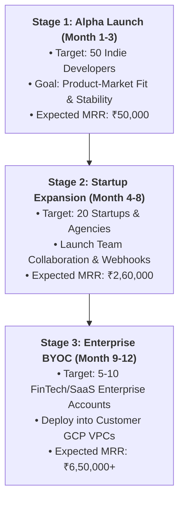

# 💼 ShipZen Commercial Economics, Subscription Pricing & Business Plan (INR)

> **Platform:** ShipZen (Multi-Tenant Internal Developer Platform / Mini-PaaS)  
> **Currency Base:** Indian Rupee (INR — ₹)  
> **Exchange Rate Reference:** $1 USD = ₹95.37 INR  
> **Target Audience:** Indian & Global Developers, Startups, Indie Hackers, and Mid-Market Enterprises

---

## 📑 Table of Contents
1. [Executive Summary](#1-executive-summary)
2. [Infrastructure & Operational Cost Breakdown (INR @ ₹95.37/USD)](#2-infrastructure--operational-cost-breakdown-inr--9537usd)
3. [Subscription Tiers & Feature Matrix](#3-subscription-tiers--feature-matrix)
4. [Revenue, Margins & Profitability Projections](#4-revenue-margins--profitability-projections)
5. [Key Risks & Engineering Mitigation Strategies](#5-key-risks--engineering-mitigation-strategies)
6. [Unit Economics & Growth Roadmap](#6-unit-economics--growth-roadmap)

---

# 1. Executive Summary

ShipZen solves the "cloud complexity tax" for software teams. Instead of forcing companies to pay high markups on services like Render, Vercel, or Heroku, or spend months building custom DevOps pipelines, ShipZen provides an automated, containerized "git push to deploy" PaaS that runs on modern GCP GKE infrastructure with sub-second WebSocket telemetry, automated TLS, and role-based access control.

### The Business Opportunity at ₹95.37 / USD
* **SaaS PaaS Market:** With the dollar at ₹95.37, foreign SaaS platforms (Vercel at $20 = ~₹1,907/seat, Render, Heroku) are significantly more expensive for Indian founders and agencies when factoring in GST (18%) and foreign transaction fees (3.5%). A predictable, INR-billed developer platform priced in India creates an immediate 30–40% cost advantage.
* **Enterprise BYOC (Bring Your Own Cloud):** High-growth Indian tech startups (Fintech, Healthtech, Edtech) have strict data residency and compliance requirements. ShipZen's ability to deploy into their **own GCP VPC** commands premium enterprise license fees (₹55,000 – ₹1,45,000+/mo).

---

# 2. Infrastructure & Operational Cost Breakdown (INR @ ₹95.37/USD)

### A. Monthly Fixed Infrastructure Costs (Baseline GCP GKE Cluster)

These are the baseline operational expenses required to run the core ShipZen control plane and shared database in the `ap-south-1` (Mumbai) GCP region:

| Component | GCP Resource Details | Monthly Cost (USD) | Monthly Cost (INR @ ₹95.37) | Cost Type |
|---|---|---|---|---|
| **Amazon GKE Control Plane** | 1 Managed Cluster ($0.10/hr) | $73.00 | **₹6,962** | Fixed |
| **System Platform Nodes** | 2x `c7i-flex.large` or `t3.large` | $80.00 | **₹7,630** | Fixed |
| **Network Ingress (ELB)** | 1 GCP Classic / Network LB | $20.00 | **₹1,907** | Fixed |
| **Relational Storage (Postgres)**| 50 GB gp3 EBS Volume + Snapshots | $6.00 | **₹572** | Semi-Variable |
| **Redis Cache / State** | In-Cluster Redis Allocation | $5.00 | **₹477** | Fixed |
| **GCP Secret Manager** | ~12 synced secrets ($0.40/mo) | $4.80 | **₹458** | Fixed |
| **Cloudflare Enterprise DNS & CA**| Free / Pro Plan | $0.00 | **₹0** | Free Tier |
| **BASE CLUSTER INFRASTRUCTURE** | **Minimum Monthly Operating Cost** | **~$188.80** | **₹18,006 / month** | Fixed Base |

---

### B. Variable / Per-User Workload Costs (Dynamic Scale)

ShipZen uses **Cluster Autoscaler spot instances** and **KEDA scale-to-zero** so build costs are strictly pay-as-you-go:

| Workload Activity | GCP Resource | Cost per Unit (INR @ ₹95.37) | Monthly Impact (100 Active Devs) |
|---|---|---|---|
| **Ephemeral Build Execution** | Cluster Autoscaler Spot EC2 (`c7i.xlarge` / build) | **₹0.38 per build minute** | ~₹5,700 (15,000 mins) |
| **Tenant Container Runtime** | Shared Kubernetes Node Capacity | **₹170 – ₹335 / app / mo** | ~₹25,000 (100 apps) |
| **GCS Build Logs Storage** | GCS Standard ($0.023/GB) | **₹2.19 per GB** | ~₹110 (50 GB) |
| **Artifact Registry Container Registry** | Artifact Registry Storage ($0.10/GB) | **₹9.54 per GB** | ~₹954 (100 GB images) |
| **Data Transfer / Egress** | GCP Internet Out ($0.09/GB) | **₹8.58 per GB** | ~₹4,290 (500 GB egress) |

---

# 3. Subscription Tiers & Feature Matrix

```
┌──────────────────────┬──────────────────────┬──────────────────────┬───────────────────────┐
│ 🟢 STARTER / HOBBY   │ 🔵 DEVELOPER PRO     │ 🟣 STARTUP TEAM      │ 🟡 ENTERPRISE (BYOC)  │
│ ₹0 / month           │ ₹1,699 / month       │ ₹7,999 / month       │ ₹54,999 – ₹1,45,000+  │
│ For Hobbyists & Stds │ For Solo Devs & Apps │ For 5-15 Member Teams│ In Customer's Own GCP │
└──────────────────────┴──────────────────────┴──────────────────────┴───────────────────────┘
```

### Detailed Feature Breakdown per Tier

| Feature & Capability | 🟢 Starter (₹0) | 🔵 Pro (₹1,699/mo) | 🟣 Team (₹7,999/mo) | 🟡 Enterprise (₹54,999+/mo) |
|---|---|---|---|---|
| **Monthly Pricing** | **₹0 / mo** | **₹1,699 / mo** (~$17.8) | **₹7,999 / mo** (5 seats) | **Custom Quote** (₹55k–₹1.45L) |
| **Additional Seats** | N/A (1 user) | N/A (1 user) | ₹1,699 / seat / mo | Unlimited Seats |
| **Active Projects** | Up to 2 Projects | Unlimited Projects | Unlimited Projects | Unlimited Projects |
| **Build Minutes** | 300 mins / mo | 2,500 mins / mo | 12,000 mins / mo | Unlimited (Own Compute) |
| **Build Minute Overages**| Hard cutoff | ₹0.85 / min | ₹0.55 / min | Zero markup (GCP direct) |
| **Concurrent Builds** | 1 build | 2 concurrent builds | 5 concurrent builds | Unlimited concurrency |
| **Container Runtime** | Inactive sleep (15m)| 24/7 Always-On | 24/7 Always-On + Auto-scale| High Availability HA Nodes |
| **Domains & Routing** | `*.shipzen.dev` | Custom Domains + TLS | Custom Domains + Apex DNS | Private VPC + Internal DNS |
| **Log Streaming** | REST polling | Real-time WebSockets | Real-time WebSockets | GCS Archive + Datadog / Loki |
| **GitHub Integration** | Public Repos | Private + Public Repos| GitHub App Org Sync | GitHub Enterprise / GitLab |
| **Role-Based Access (RBAC)**| None | None | `Admin`, `Member`, `Viewer`| Granular RBAC + Okta/SAML |
| **Observability** | Basic Health | Basic Health | Full Prometheus/Grafana | Custom Dashboards + SLOs |
| **Support SLA** | Community Discord | Email (48h SLA) | Priority Slack (12h SLA) | 24/7 Dedicated Slack (1h) |

---

# 4. Revenue, Margins & Profitability Projections

### Unit Economics per Paying Customer
* **Developer Pro (₹1,699/mo):**
  * Avg GCP compute used: ~₹385/mo
  * Gross Margin: **~₹1,314/mo (77.3% Margin)**
* **Startup Team (₹7,999/mo):**
  * Avg GCP compute used: ~₹1,980/mo
  * Gross Margin: **~₹6,019/mo (75.2% Margin)**
* **Enterprise BYOC (₹75,000/mo avg):**
  * ShipZen hosts only control plane or software license (Zero compute cost).
  * Gross Margin: **~₹69,000/mo (92.0% Margin)**

---

### Projected Monthly P&L at Scale (12-Month Projection)

```
Scenario: 250 Free Users | 100 Pro Users | 25 Team Users | 3 Enterprise Customers
```

| Financial Metric | Amount in USD | Amount in INR (@ ₹95.37) | Notes |
|---|---|---|---|
| **Pro Subscriptions (100 @ ₹1,699)** | $1,781 | **₹1,69,900** | Stable monthly recurring |
| **Team Subscriptions (25 @ ₹7,999)** | $2,097 | **₹1,99,975** | Growing teams (avg 6 seats) |
| **Enterprise BYOC (3 @ ₹75,000)** | $2,359 | **₹2,25,000** | High-value annual contracts |
| **Build Minute Overages** | $299 | **₹28,500** | Heavy usage pipelines |
| **TOTAL GROSS REVENUE (MRR)** | **$6,536** | **₹6,23,375 / month** | **₹74.8 Lakhs ARR** |
| — GCP Base Cluster Costs | -$189 | -₹18,006 | Fixed GKE & Load Balancers |
| — GCP Dynamic Compute & Bandwidth | -$950 | -₹90,602 | Tenant pods & Cluster Autoscaler Spot |
| — Payment Gateway Fees (Razorpay/Stripe ~2%)| -$131 | -₹12,468 | Domestic card & UPI fees |
| — Operational Tooling & Misc | -$200 | -₹19,074 | Email, alerts, domain renewals |
| **TOTAL MONTHLY EXPENSES** | **-$1,470** | **-₹1,40,150 / month** | |
| **NET MONTHLY OPERATING PROFIT** | **$5,066** | **₹4,83,225 / month** | **~77.5% Net Margin** |
| **ANNUAL NET PROFIT (RUN RATE)** | **$60,792** | **₹57,98,700 / year** | **~₹58.0 Lakhs Net Profit** |

---

# 5. Key Risks & Engineering Mitigation Strategies

```text
┌────────────────────────────────────────────────────────────────────────────────────────┐
│                                 RISK MITIGATION MATRIX                                 │
├──────────────────────────┬─────────────────────────────┬───────────────────────────────┤
│ Risk Category            │ Potential Threat / Impact   │ ShipZen Architecture Solution │
├──────────────────────────┼─────────────────────────────┼───────────────────────────────┤
│ 1. Crypto Mining / Abuse │ Free-tier users abusing     │ Isolated `shipzen-build` pods │
│    on Builder Pods       │ build compute to mine crypto│ with 15-min hard timeout and  │
│                          │ resulting in massive bills. │ strict CPU/Memory ceilings.   │
├──────────────────────────┼─────────────────────────────┼───────────────────────────────┤
│ 2. Container Breakout &  │ Malicious user code         │ Pod Security Standards (PSS)  │
│    Multi-Tenant Leakage  │ accessing host GKE nodes or │ restricted profile + Kyverno  │
│                          │ other tenant databases.     │ NetworkPolicies per tenant.   │
├──────────────────────────┼─────────────────────────────┼───────────────────────────────┤
│ 3. Egress Bandwidth      │ User hosts a viral site or  │ Cloudflare CDN caching proxy  │
│    Bill Shock            │ media file, generating high │ with rate limits (`slowapi`)  │
│                          │ GCP data transfer charges.  │ and bandwidth quotas.         │
├──────────────────────────┼─────────────────────────────┼───────────────────────────────┤
│ 4. Runaway Cluster Autoscaler     │ Broken build loops or KEDA  │ NodePool hard limits:         │
│    Node Scaling          │ scaling hundreds of nodes.  │ `cpu: "20"`, `memory: 40Gi`   │
│                          │                             │ in `infra/scale/Cluster Autoscaler.yaml`│
├──────────────────────────┼─────────────────────────────┼───────────────────────────────┤
│ 5. Database Connection   │ Traffic spikes exhausting   │ `ThreadedConnectionPool` with │
│    Exhaustion            │ PostgreSQL connections.     │ connection pooling & timeouts.│
└──────────────────────────┴─────────────────────────────┴───────────────────────────────┘
```

### Deep Dive: How to Avoid Financial & Technical Failures

1. **Strict Builder Resource Limits:**
   - In [`worker/builder.py`](file:///c:/Project/ShipZen/worker/builder.py), every ephemeral pod is injected with:
     ```yaml
     resources:
       limits:
         cpu: "2"
         memory: "4Gi"
       requests:
         cpu: "500m"
         memory: "1Gi"
     activeDeadlineSeconds: 900 # 15-minute hard timeout
     ```
   - If a build runs past 15 minutes (or tries to spawn a crypto miner), Kubernetes instantly terminates the pod.

2. **Cluster Autoscaler Budget Boundaries:**
   - In [`infra/scale/Cluster Autoscaler.yaml`](file:///c:/Project/ShipZen/infra/scale/Cluster Autoscaler.yaml), hard maximum limits are enforced:
     ```yaml
     limits:
       cpu: 20
       memory: 40Gi
     ```
   - This ensures your maximum possible GCP compute bill is strictly capped at ~₹18,000/mo regardless of incoming traffic.

3. **Payment Gateways with Automated Subscriptions:**
   - Integrate **Razorpay Subscriptions** (for Indian Cards, UPI AutoPay, NetBanking) and **Stripe Billing** (for International USD payments).
   - Require credit card / UPI mandate verification before unlocking the Pro tier.

---

# 6. Unit Economics & Growth Roadmap



### Strategic Recommendation for Go-to-Market:
1. **Developer First:** Launch with a generous **Hobby Tier (₹0)** to build community awareness on X (Twitter), LinkedIn, Product Hunt, and GitHub.
2. **Target Mid-Market Startups:** Offer the **Startup Team Tier (₹7,999/mo)** as a 50% cheaper, higher-performance alternative to Render/Vercel with team collaboration.
3. **Enterprise Engine:** Pitch the **BYOC License (₹54,999 – ₹1,45,000/mo)** to Indian tech startups who are already spending ₹5–15 Lakhs/month on GCP and want a unified developer portal without hiring a 3-person DevOps team.
