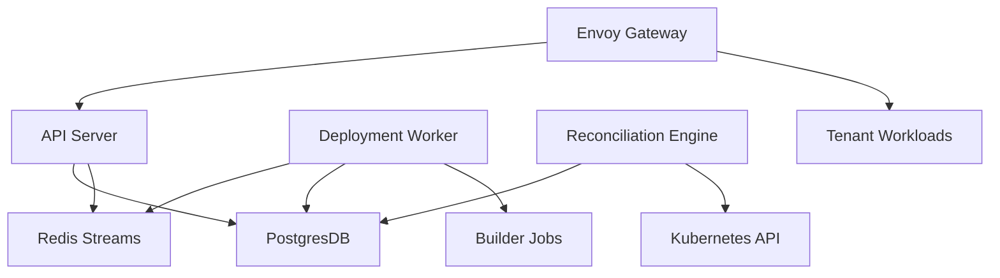

# Service Dependency Graph

```mermaid
graph TD
    API[API Server] --> Postgres[PostgresDB]
    API --> Redis[Redis Streams]
    Worker[Deployment Worker] --> Redis
    Worker --> Postgres
    Worker --> Builder[Builder Jobs]
    Controller[Reconciliation Engine] --> Postgres
    Controller --> K8s[Kubernetes API]
    Gateway[Envoy Gateway] --> API
    Gateway --> Workloads[Tenant Workloads]
```
