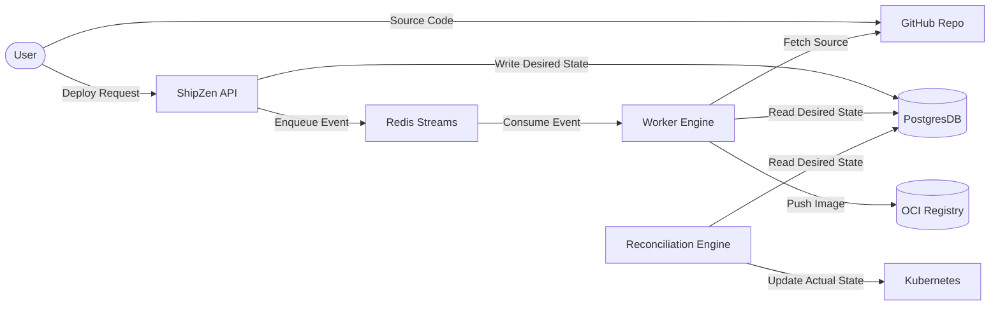

# Data Flow Diagram

```mermaid
flowchart LR
    User([User]) -->|Source Code| GitHub[GitHub Repo]
    User -->|Deploy Request| API[ShipZen API]
    API -->|Write Desired State| DB[(PostgresDB)]
    API -->|Enqueue Event| Queue[Redis Streams]
    
    Queue -->|Consume Event| Worker[Worker Engine]
    Worker -->|Fetch Source| GitHub
    Worker -->|Push Image| Registry[(OCI Registry)]
    Worker -->|Read Desired State| DB
    
    Controller[Reconciliation Engine] -->|Read Desired State| DB
    Controller -->|Update Actual State| K8s[Kubernetes]
```
